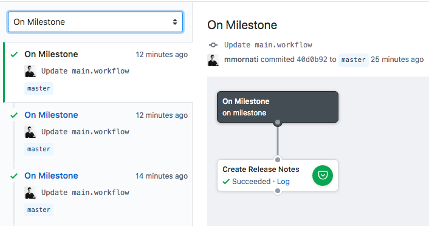

[](https://circleci.com/gh/Decathlon/release-notes-generator-action)

# release-notes-generator-action
GitHub Action to create an auto release note when Milestone is closed.

The action is using the [Spring.io release-notes generator](https://github.com/spring-io/github-release-notes-generator) to create a wonderful automatic release note.


## Why?

Why we are not simply automating the release creation and push the release notes there?
We think in some cases it is better to keep release notes separated from the release process... yeah, maybe the right name is not release notes anymore. :)
Just think of a continuous deployment project: anytime you are pushing to the repository a new version of the application is built and pushed in production. Which also means that a new release was created to complete the process; a release with a **single** function inside.
We think it is not a good idea to push to your 'application users' a new release notes message anytime you're pushing (let us say 10 times a day?). In this such of projects we prefer to communicate only once a Sprint (or with the time split you prefer), which gave you a bigger release notes containing the information pushed in production with the latest 30/40 releases.

## Getting Started 
The usage is really simple, you just need to add the Action reference in your GitHub workflow.

```
workflow "On Milestone" {
  on = "milestone"
  resolves = ["Create Release Notes"]
}

action "Create Release Notes" {
  uses = "Decathlon/release-notes-generator-action@master"
  secrets = ["GITHUB_TOKEN"]
}
```

**NOTE**: it is important to add the *GITHUB_TOKEN* secret because the action needs to access to your repository Milestone/Issues information using the GitHub API.

As we filtered on *milestone* the action will execute anytime an event occurs on your repository milestones.



The action is then filtered on *closed* events. All other events on the milestones will only log an action execution but the release notes won't be created.

```
### STARTED Create Release Notes 14:25:34Z
[...]
Getting Action Information
Release note generation skipped because action was: opened

### SUCCEEDED Create Release Notes 14:25:55Z (21.262s)
```

```
### STARTED Create Release Notes 14:25:41Z
[...]
Getting Action Information

  .   ____          _            __ _ _
 /\\ / ___'_ __ _ _(_)_ __  __ _ \ \ \ \
( ( )\___ | '_ | '_| | '_ \/ _` | \ \ \ \
 \\/  ___)| |_)| | | | | || (_| |  ) ) ) )
  '  |____| .__|_| |_|_| |_\__, | / / / /
 =========|_|==============|___/=/_/_/_/
 :: Spring Boot ::        (v2.1.0.RELEASE)

2019-04-14 14:25:57.901  INFO 125 --- [           main] io.spring.releasenotes.Application       : Starting Application v0.0.2 on 5cbc3fcc29cd with PID 125 (/github-release-notes-generator.jar started by root in /github/workspace)
2019-04-14 14:25:57.922  INFO 125 --- [           main] io.spring.releasenotes.Application       : No active profile set, falling back to default profiles: default
2019-04-14 14:26:00.905  INFO 125 --- [           main] io.spring.releasenotes.Application       : Started Application in 4.178 seconds (JVM running for 5.345)
## :star: New Features

- test 2 [#2](https://github.com/Decathlon/test/issues/2)

### SUCCEEDED Create Release Notes 14:26:07Z (26.262s)
```

## Configure output folder
By default the release file is created into the Docker home folder. If you want you can specify a custom folder for your file creation via the `OUTPUT_FOLDER` environment variable.

## Custom output release file
By default the output is created into *release_file.md* file. You can control the output name using environment variables in your action.

### Prefixed name
Providing the `FILENAME_PREFIX` environment variable, you can control the output file name which will have the provided prefix name with the milestone id.

```
action "Create Release Notes" {
  uses = "Decathlon/release-notes-generator-action@master"
  secrets = ["GITHUB_TOKEN"]
  env = {
    FILENAME_PREFIX = "MyMilestone"
  }
}
```

The output filename will be `MyMilestone_2` (if the milestone id is 2).

### Use Milestone title
Providing the `USE_MILESTONE_TITLE` environment variable which allow you to switch the name to the Milestone title instead of providing a *static* one.
The title will be modified replacing spaces with underscore '_' char.

```
action "Create Release Notes" {
  uses = "Decathlon/release-notes-generator-action@master"
  secrets = ["GITHUB_TOKEN"]
  env = {
    USE_MILESTONE_TITLE = true
  }
}
```

```
[...]
Creating release notes for Milestone 1 into the Sprint_10.md file
[...]
### SUCCEEDED Create Release Notes 15:53:53Z (15.913s)
```

## How to use the generated file
The idea is to keep the control about what to do with the release notes file. So simply link a new action and: send it by mail, push it on your website, on the github wiki, ... 

Personally, in some of our projects, we are pushing the release note as new GitHub wiki page using the [Wiki page creator action](https://github.com/Decathlon/wiki-page-creator-action).

