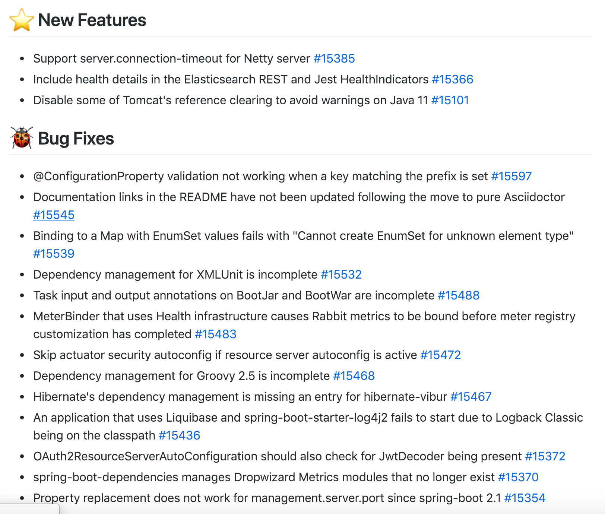
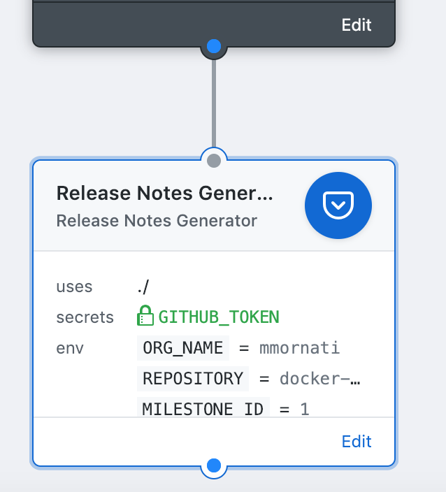

# release-note-generator-action
GitHub Action to create a release notes using the Spring.io release notes generator script.

## What is this for?
This script is intended to help you to aumates the release notes for your project. It is generated based on the Spring.io release notes generator script: [https://github.com/spring-io/github-release-notes-generator](https://github.com/spring-io/github-release-notes-generator)

And it is creating a relase notes like the one you can, for example, find on the Spring-Boot project: https://github.com/spring-io/github-release-notes-generator



## How can I use it?
The script is using environment variables and secrets to connect to GitHub and retrieve the necessary informaation for the release notes generation.

* **RELEASE_NOTE_GENERATOR_VERSION**: Version of the script to use. By default is configured to use v1.0.0 (right now the latest one).
* **ORG_NAME**: organization name owning the project you want to generate release notes for
* **REPOSITORY**: your project name.
* **MILESTONE_ID**: the milestone id. It should retrieved directly by the GitHub action flow (in progress)
* **TARGET_FILE**: target markdown file in which you want to create the release notes. By default *release_notes.md*. You can link to the action to upload it to your GitHub repo (release creation? wiki page? or whatever you want)

## Sample usage workflow configuration

```
workflow "New workflow" {
  on = "milestone"
  resolves = ["Release Notes Generator"]
}

action "Release Notes Generator" {
  uses = "./"
  secrets = ["GITHUB_TOKEN"]
  env = {
    ORG_NAME = "decathlon"
    REPOSITORY = "my-test-repo"
    MILESTONE_ID = "1"
  }
}
```



# Credits
The code of this actions began on [mmornati](https://github.com/mmornati) github workspace. 

